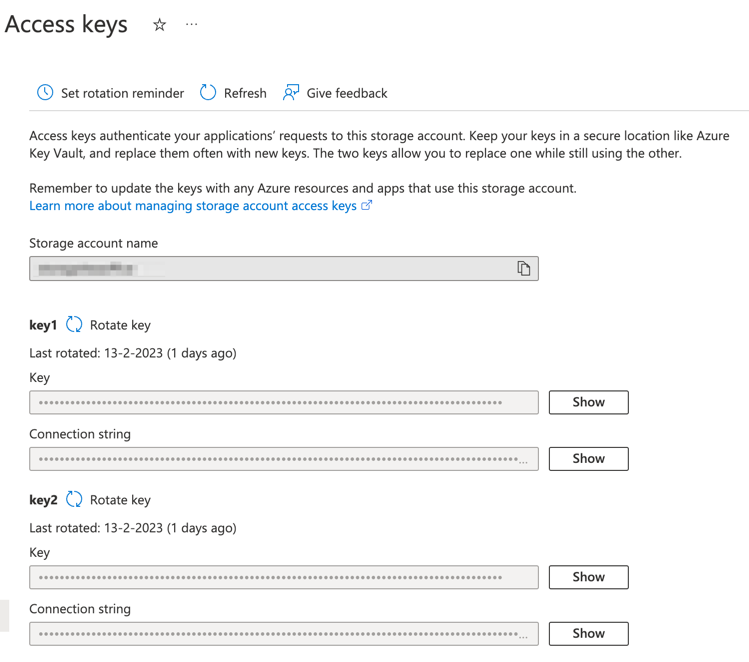

# jield-export

This repo can be used to export database objects (using Doctrine) to External data formats (Excel/Parquet/CSV)

## Installation

To enable this module in a Laminas application, ad the following to the `modules` section of
your `config/application.config.php` file:

```php
    return [
        'Jield\\Export',
    ];
``` 

## Configuration

Each entity which has to be exported has to be registered in the configuration file. The following snippet shows how
this can be done.
It is also possible to include this array in the configuration files

```php
<?php

declare(strict_types=1);

namespace General;

use General\Export\Country\CountryColumns;

return [
    'jield_export' => [
        'entities' => [
            'country' => CountryColumns::class
        ],
    ]
];
```

## Columns file

Each object has to be transformed in to a set of columns. This is done by creating a class which extends
the `AbstractEntityColums`. An example is shown below:

```php
<?php

declare(strict_types=1);

namespace General\Export\Country;

use General\Entity\Country;use Jield\Export\Columns\AbstractEntityColumns;use Jield\Export\ValueObject\Column;

final class CountryColumns extends AbstractEntityColumns
{
    protected string $name = 'dimcountry';

    /**
     * @return array<Column>
     */
    public function getColumns(): array
    {
        $qb        = $this->entityManager->createQueryBuilder();
        $countries = $qb->select('general_entity_country')
            ->from(from: Country::class, alias: 'general_entity_country')
            ->getQuery()
            ->getResult();

        $idColumn       = new Column(columnName: 'Id', type: Column::TYPE_INTEGER, isNullable: false);
        $cdColumn       = new Column(columnName: 'Cd');
        $countryColumn  = new Column(columnName: 'Country');
        $iso3Column     = new Column(columnName: 'Iso3');

        /** @var Country $country */
        foreach ($countries as $country) {
            $idColumn->addRow($country->getId());
            $cdColumn->addRow($country->getCd());
            $countryColumn->addRow($country->getCountry());
        }

        return [
            $idColumn,
            $cdColumn,
            $countryColumn,
        ];
    }
    
    public function getDependencies(): array
    {
        return [
            'organisationtype' => TypeColumns::class,
        ];
    }
}
```

When the `getDependencies` method is implemented, the dependencies will be exported ass well. This is useful when you
have
a dimension table which is used in a fact table.

The component will automatically instantiate the extended class with the `EntityManager`, if more dependencies are
needed register the class in the service manager

## Upload to Azure.

If you want to upload to a storage account (Azure Data Lake 2), the following connection string needs to be added to the
config file: 

```php

   return ['jield_export'  => [
        'azure_blob_storage_connection_string' => 'DefaultEndpointsProtocol=https;AccountName=<ACCOUNTNAME>;AccountKey=<ACCOUNTKEY>;EndpointSuffix=core.windows.net'
    ])
```
